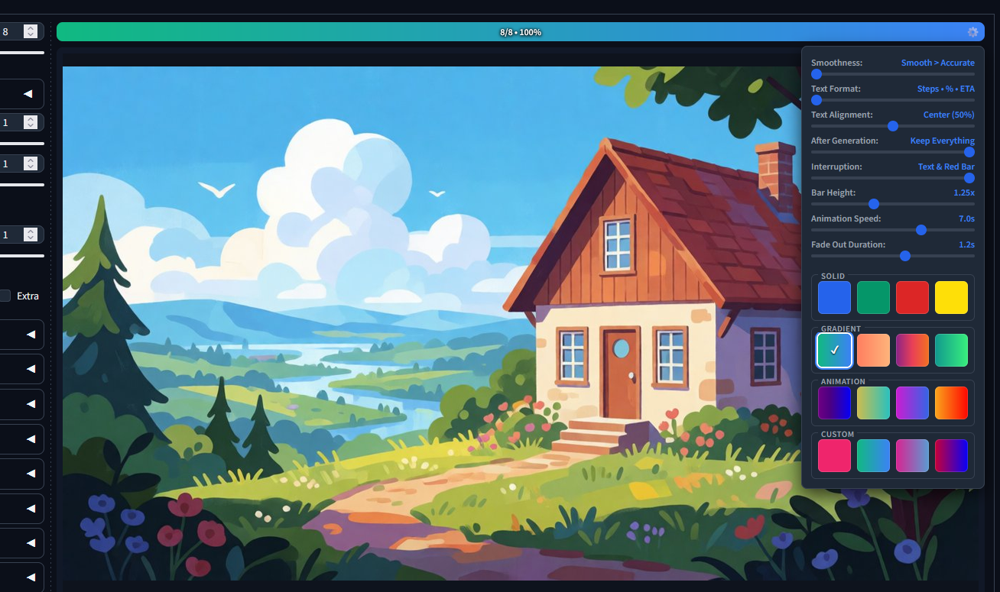

# Smooth Progress Bar for SD WebUI Forge Neo

## Features

### 🎨 Visual & Styling
* **Color Presets** - Choose one of the progress bar color presets (Solid, Gradient, Animated).
* **Custom Color** - Customize the progress bar color (Solid, Gradient, Animated).
* **Bar Height** - Adjust the thickness/height of the progress bar.
* **Animation Speed** - Control animation speed for animated bar colors.

### 📊 Progress & Animations
* **Smoothness** - Adjust how smooth progress bar will fill up (Please note that on smoother options it will not be that accurate for generations with low steps count). 
* **Text Format** - Various combinations of info (Steps, %, ETA) displayed on progress bar. 
* **Text Alignment** - Adjust text position on progress bar. 

### ⚙️ Behavior & Lifecycle
* **After Generation** - Choose what happens to the bar once generation finishes (Hide, Hide text only, Keep).
* **Fade Out Duration** - Set the time it takes for the progress bar to smoothly disappear after completion.
* **Interruption** - Custom visual behavior and indicator state when generation is canceled or interrupted.

## Changelog

<b>v1.0.1 - Fixes & tweaks</b>

* Fix progress freeze on ultra-fast generations
* Fix Smooth Progress ETA: per-step duration tracker prevents rising timer and jitter
* Widen Animation Speed range to 1-20s, Fade Out Duration max to 4s
* Show progress bar at startup before first generation in Keep Everything / Fade Out (Only Text) modes

<b>v1.0.0 - Initial Release</b>

* **Core Features**
  * Added customizable progress bar animation with adjustable **Smoothness** levels.
  * Added customizable **Text Format** options (Steps, %, ETA combinations).
  * Added **Text Alignment** settings.

* **Styling & Customization**
  * Added **Color Presets** (Solid, Gradient, Animated) and **Custom Color** options.
  * Added **Bar Height** adjustment.
  * Added **Animation Speed** controls for animated colors.

* **Behavior & Effects**
  * Added **After Generation** behavior modes (*Hide*, *Hide text only*, *Keep*).
  * Added **Fade Out Duration** settings for smooth transitions.
  * Added dedicated **Interruption** state handling for canceled generations.
  * Designed and optimized specifically for **SD WebUI Forge Neo**.

## Installation
1. Open SD Webui Forge Neo
2. Go to Extensions → Install from URL
3. Paste: `https://github.com/diamfang/sd-webui-smooth-progress`
4. Click Install, then reload the WebUI

> [!WARNING]
>This extension was tested only for Forge Neo. I cannot guarantee that it will work for Automatic1111 or Forge Classic.

## Credits
* Made for [Forge Neo](https://github.com/Haoming02/sd-webui-forge-classic/tree/neo) by Haoming02
* Other extension by me: [Output Folder Switcher](https://github.com/diamfang/sd-webui-folder-switcher)

